EasySearch API: https://github.com/dincer-ince/easy-search-api

# EasySearch

EasySearch is a project aimed at providing users with a centralized solution for storing, managing, analyzing, and searching through documents. It consists of a web application and an API. The web application serves as a standalone document management system, allowing users to efficiently manage, view, edit, and add new documents. The API offers natural language processing functionality for developers to easily integrate document search and recommendation features into their existing systems. EasySearch caters to both general users looking for a cloud-based document management solution and developers in need of simplified and effective natural language processing capabilities.

## Access
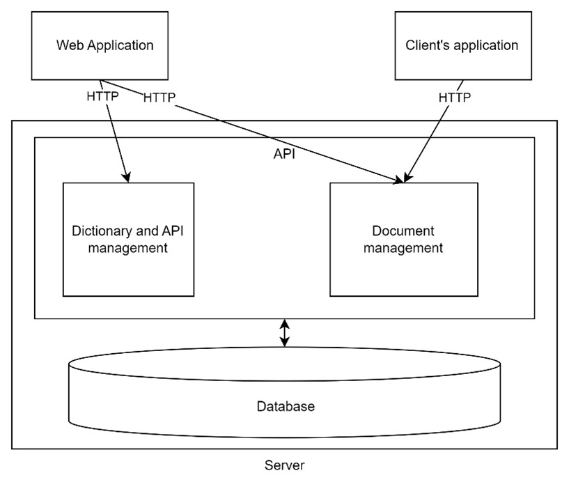

## Dictionaries
Dictionaries are the folder structure implementation of the EasySearch, users can create their own dictionaries and in them, define the extra fields they would like to store with their documents as well as set the preferred search function they would like to use in this dictionary.

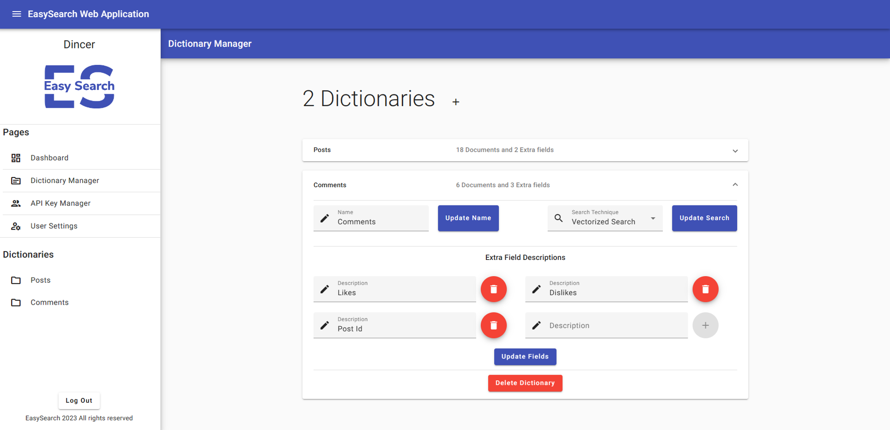

## Search
Searching can be done inside the dictionaries. The dictionaries contain a preferred search technique, which the system uses to determine which technique to use when the user sends a search request. There are two techniques currently implemented, one of them is exact search, which through the inverted index table filters the results to only the documents that contain every word of the query. Other technique is the vectorized search, which creates a vector from the document with dimension of the index table length, then performs cosine similarity with each document against the query, then ranks them based on similarity.

## Document Processing

After uploading the document to the system, the system first pre-processes the document through tokenizing the document and then lemmatizing the tokens. After that the system uses its own implementation of the inverted index table(similar implementation can be seen in figure below), to add the words that previously didn’t exist in the system and bind the words of the document to the words in the table. This operations indexes the document which can then be used in the search operations.

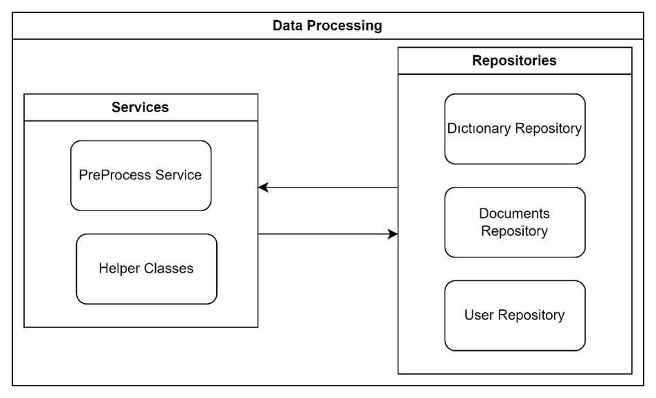

## Screenshots

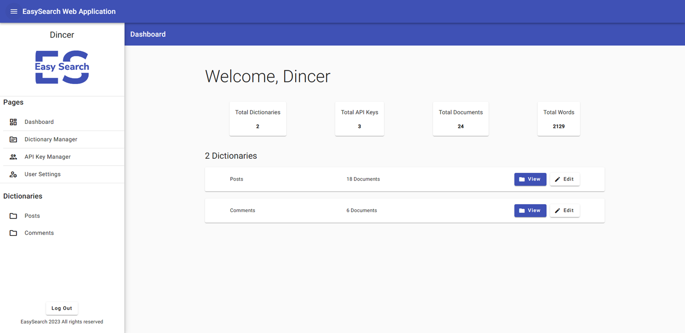

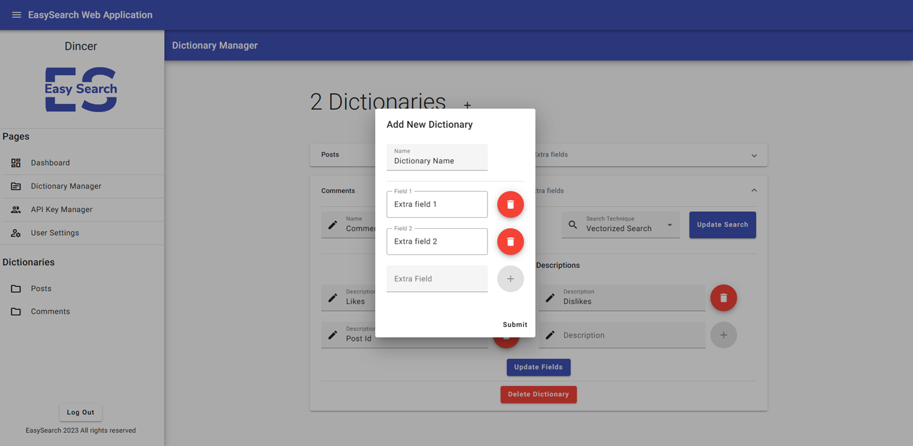
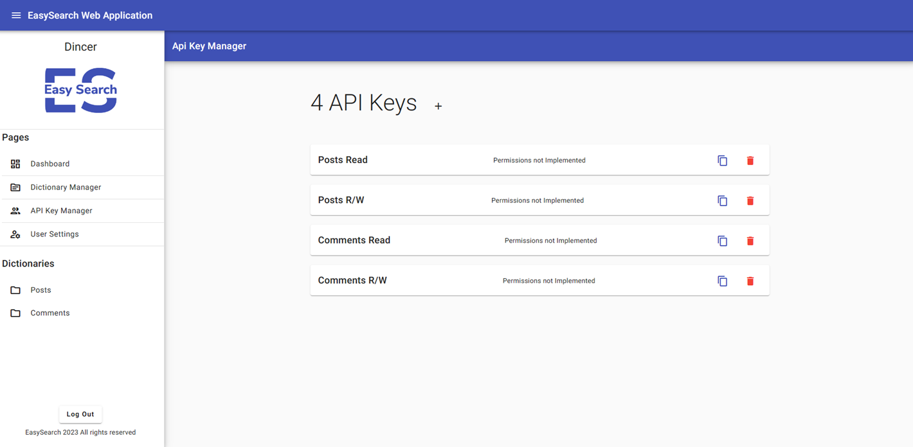
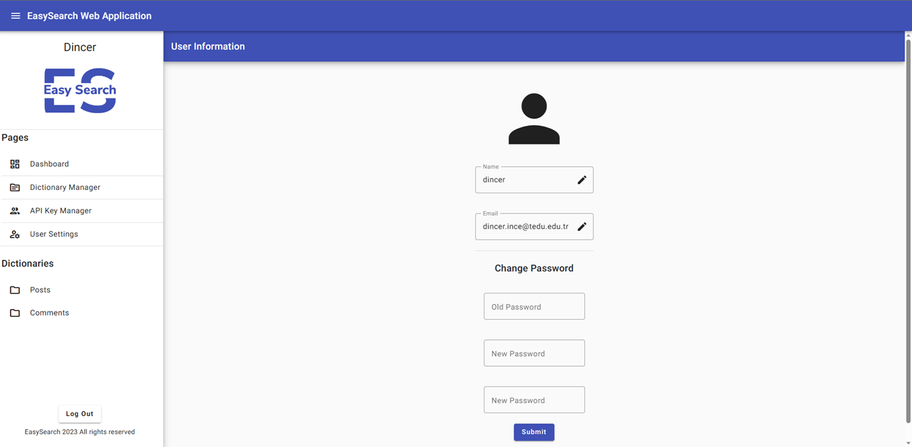
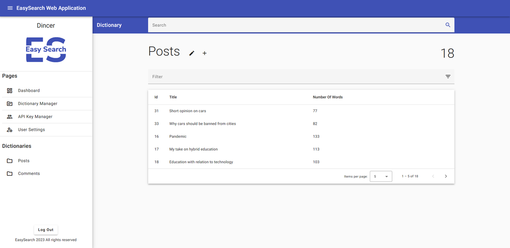
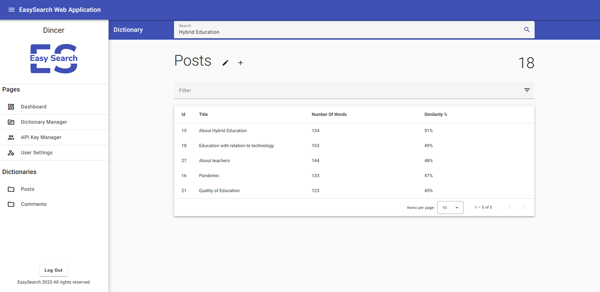
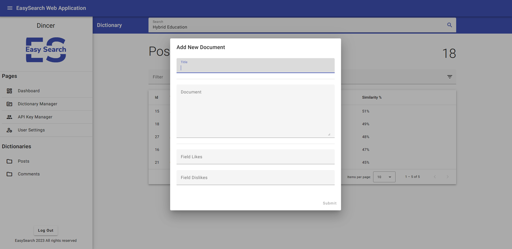
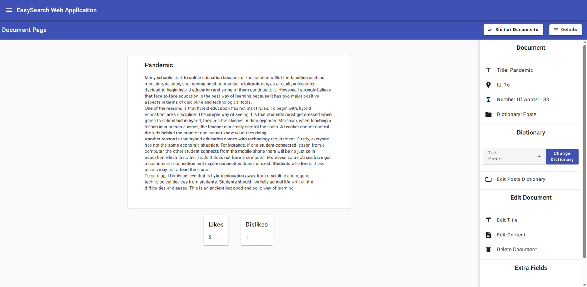
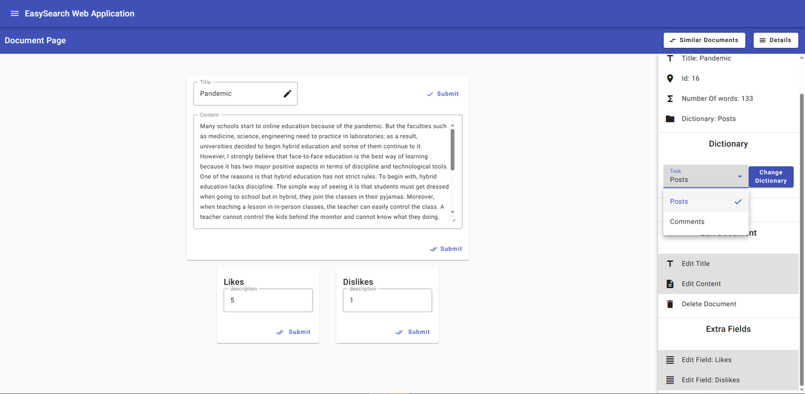
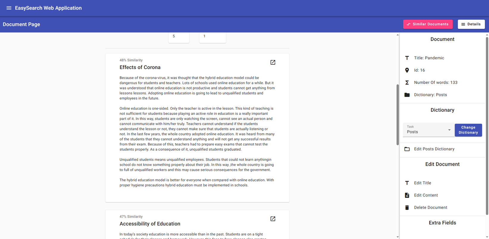